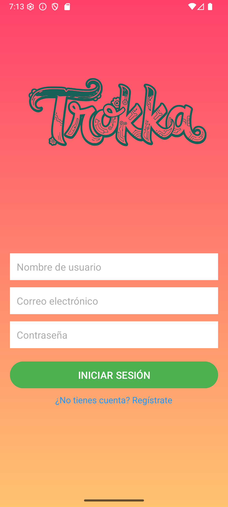
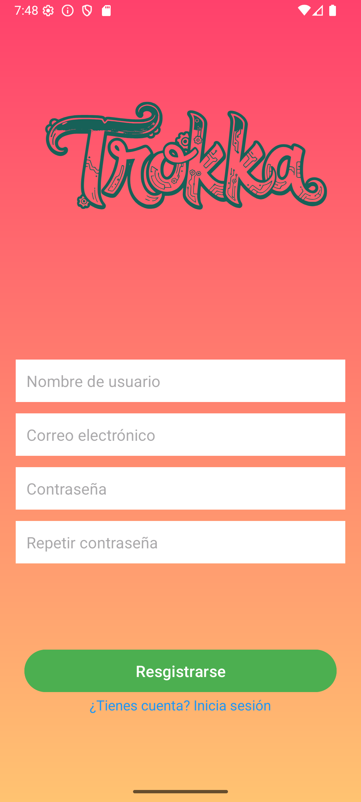
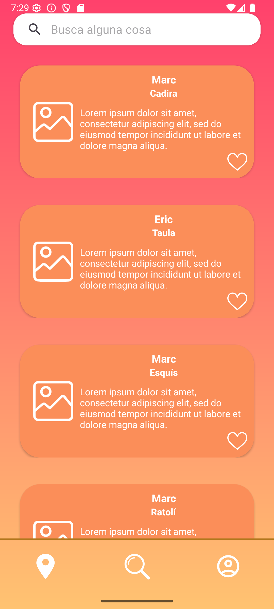
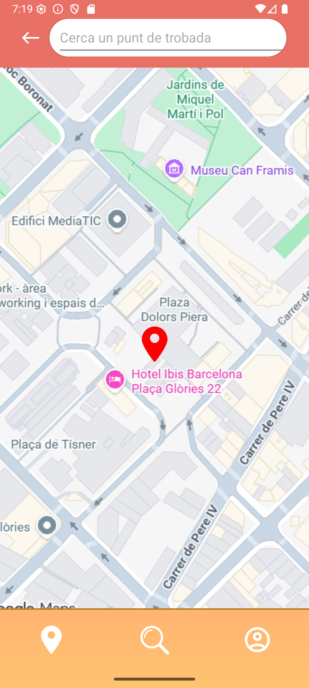
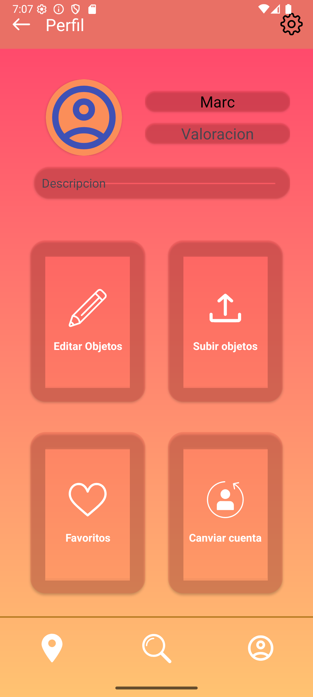
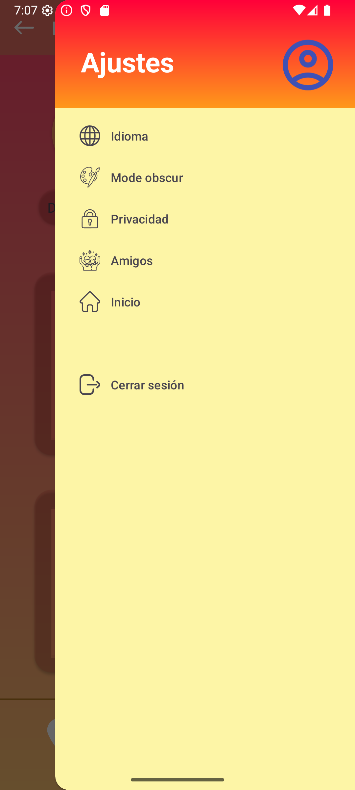

# Trokka
**Autors:**
- Eric Jiménez
- Marc Bertran
---

### Objectiu de l'aplicació.
**Trokka** té com a objectiu principal reviure l'esperit del bescanvi (trueque), 
en una societat capitalista i consumista. Fomentarà la segona ma i reduir els 
residus produïts. A més a més, connectarà els usuaris en un espai físic, 
revivint el mercat ambulant.

Tots els usuaris s'hauran de registrar, de forma gratuïta, per poder pujar, 
editar, eliminar i buscar objectes. Es podrà buscar objectes segons el seu 
nom i definició introduïts per l'usuari propietari de l'objecte. En un futur
es poden incloure categories, preestablertes, i buscar segons aquestes 
categories.

---

### Pantalles de la aplicació
Abans de començar apareix una *Splash Screen* per donar temps de carregar a
l'aplicació.

#### Iniciar Sessió.
Primera pantalla que s'obre en entrar a l'app. Aquí podràs iniciar sessió o,
fent clic a un missatge, anar a la **pàgina de registrar** un usuari nou en
el cas de no tenir-ne cap de creat.

En fer clic al botó d'iniciar sessió, es comprova el teu usuari, i sí es
Correcte, et dirigeix a la **pantalla principal**.

#### Pàgina de registre.
Podràs registrar un usuari, en el cas de no tenir-ne. Si s'ha arribat aqui
per error es pot tornar enrere fent clic al text de color blau.
S'haura d'introduir un nom, un correu , una contrasenya i verificar la 
contrasenya inserida, si no coincideixen no es registra l'usuari. Un cop
verificat l'usuari podra entrar a l'app i utulitzar-la de forma normal.

En fer clic al botó de registrar-se et dirigeix a la **pantalla principal**.

#### Pantalla principal (loby)
La pantalla de loby on es busquen tots els productes que vulgui l'usuari.
Aquesta funcionalitat es realitza amb un RecycerView, és un element utilitzat
per a repetir el mateix element, en aquest cas és un CardView, s'integra
utilitzant dues classes, Holder i Adapter. L'adapter gestiona tota la llista
d'ítems que es volen mostrar i el holder enllaça la informació dels productes
amb el layout de la CardView. A la part superior hi ha un quadre de cerca
per filtrar per títol o descripció de cada objecte.

Aquestes funcions es repeteixen a l'apartat de **preferits** i **els meus objectes**

#### Mapa
Not yet implemented.

La idea es tenir una barra de cerca per poder buscar els punts de trobada mes 
proprs a l'usuari o al carrer que s'indiqui. D'aquesta manera els usuaris podran 
trobarse i veure els objectes en persona. Al fer clic en un lloc es mostrara 
un desplegable amb la informació del lloc.

#### Perfil
Aquesta pantalla permet la modificació de les dades de l'usuari. Amb un botó
a la toolbar es desplegarà un NavigationView amb preferències de l'aplicació.

Disposa de 4 botons:
1. Editar els objectes de l'usuari.  
    _Disposa dels mateixos elements, ReciclerView, Adapter i Holder, explicats en el **Loby**._ 
2. Pujar un objecte nou.
3. Veure els objectes guardats com a preferits per l'usuari.  
   _Disposa dels mateixos elements, ReciclerView, Adapter i Holder, explicats en el **Loby**._
4. Tancar la sessió i canviar de compte.

#### Info general
El **Mapa**, el **Perfil** i el **Loby** disposen d'un menú inferior, amb tres
icones, per moure's a través de l'aplicació a les diferents pàgines.

