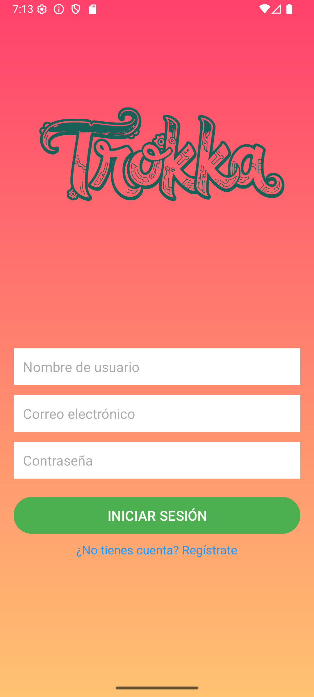
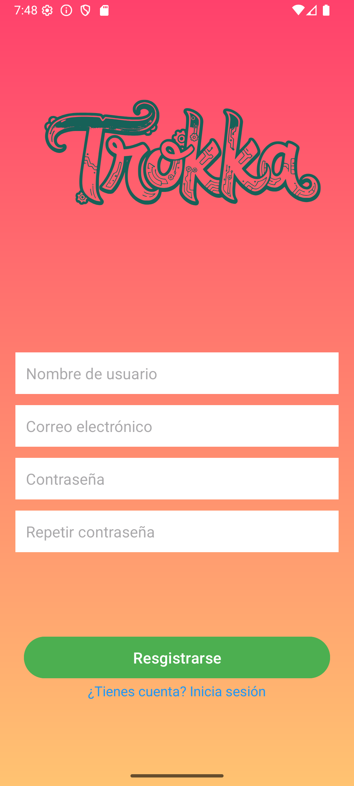
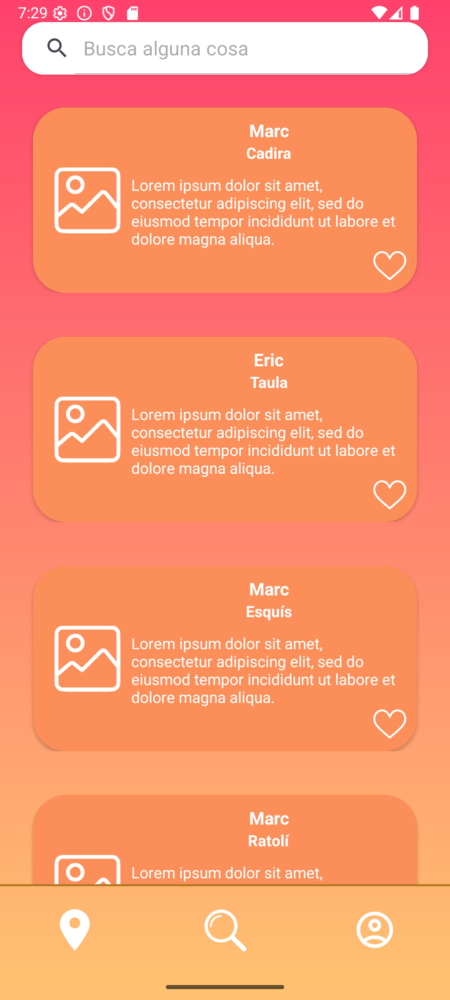
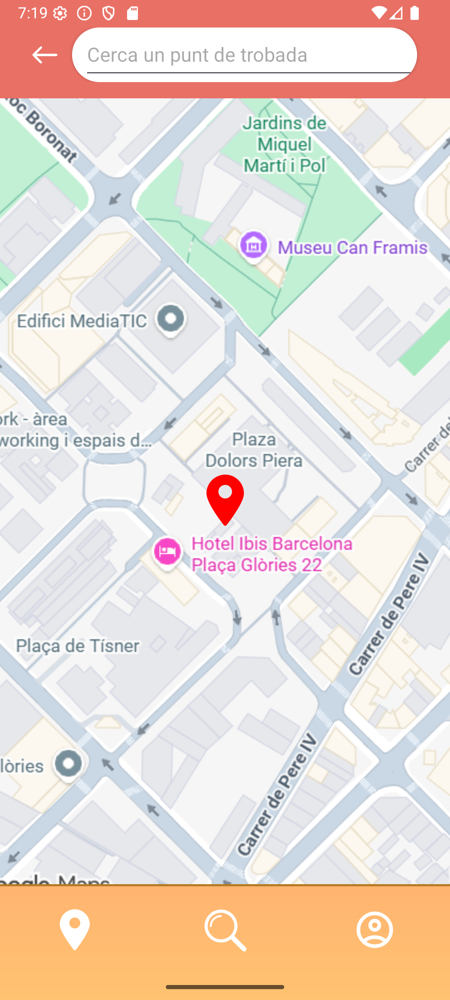
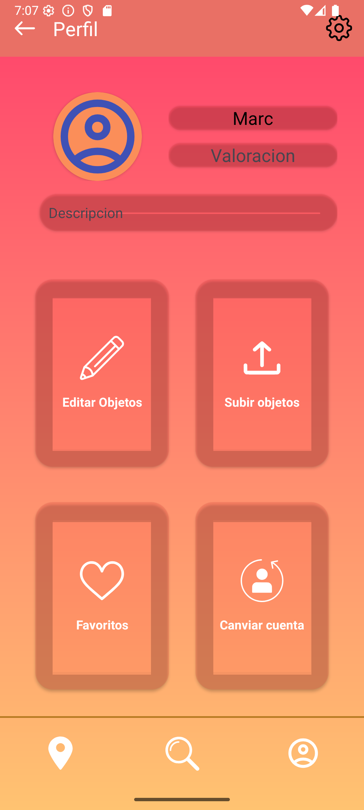
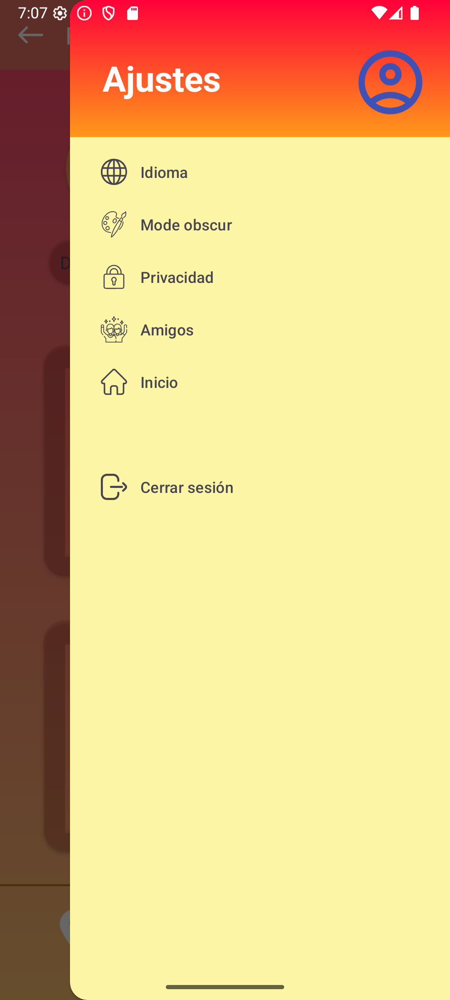

# Trokka
**Autors:**
- Eric Jiménez
- Marc Bertran
---

### Objectiu de l'aplicació.
**Trokka** té com a objectiu principal reviure l'esperit del bescanvi (trueque), 
en una societat capitalista i consumista. Fomentarà la segona ma i reduir els 
residus produïts. A més a més, connectarà els usuaris en un espai físic, 
revivint el mercat ambulant.

Tots els usuaris s'hauran de registrar, de forma gratuïta, per poder pujar, 
editar, eliminar i buscar objectes. Es podrà buscar objectes segons el seu 
nom i definició introduïts per l'usuari propietari de l'objecte. En un futur
es poden incloure categories, preestablertes, i buscar segons aquestes 
categories.

---

### Pantalles de la aplicació
Abans de començar apareix una *Splash Screen* per donar temps de carregar a
l'aplicació.

#### Iniciar Sessió.
Primera pantalla que s'obre en entrar a l'app. Aquí podràs iniciar sessió o,
fent clic a un missatge, anar a la **pàgina de registrar** un usuari nou en
el cas de no tenir-ne cap de creat.

Per tal de realitzar l'inici de sessió es fa amb un ViewModel, per mantenir
separades del comportament de l'aplicació. També s'utilitzen variables
LiveData i MutableLiveData per les seves funcionalitats extres. Com la
funció observe que permet programar una acció en el moment en el qual es
modifica la variable.

En fer clic al botó d'iniciar sessió, es comprova el teu usuari, i sí es
Correcte, et dirigeix a la **pantalla principal**.

#### Pàgina de registre.
Podràs registrar un usuari, en el cas de no tenir-ne. Si s'ha arribat aqui
per error es pot tornar enrere fent clic al text de color blau.
S'haura d'introduir un nom, un correu , una contrasenya i verificar la 
contrasenya inserida, si no coincideixen no es registra l'usuari. Un cop
verificat l'usuari podra entrar a l'app i utulitzar-la de forma normal.

Per tal de realitzar le registre es fa amb un ViewModel, per mantenir
separades del comportament de l'aplicació. També s'utilitzen variables
LiveData i MutableLiveData per les seves funcionalitats extres. Com la
funció observe que permet programar una acció en el moment en el qual es
modifica la variable.

En fer clic al botó de registrar-se et dirigeix a la **pantalla principal**.

#### Pantalla principal (loby)
La pantalla de loby on es busquen tots els productes que vulgui l'usuari.
Aquesta funcionalitat es realitza amb un RecycerView, és un element utilitzat
per a repetir el mateix element, en aquest cas és un CardView, s'integra
utilitzant dues classes, Holder i Adapter. L'adapter gestiona tota la llista
d'ítems que es volen mostrar i el holder enllaça la informació dels productes
amb el layout de la CardView. A la part superior hi ha un quadre de cerca
per filtrar per títol o descripció de cada objecte.

Aquestes funcions es repeteixen a l'apartat de **preferits** i **els meus objectes**

#### Mapa
Not yet implemented.

La idea es tenir una barra de cerca per poder buscar els punts de trobada mes 
proprs a l'usuari o al carrer que s'indiqui. D'aquesta manera els usuaris podran 
trobarse i veure els objectes en persona. Al fer clic en un lloc es mostrara 
un desplegable amb la informació del lloc.

#### Perfil
Aquesta pantalla permet la modificació de les dades de l'usuari. Amb un botó
a la toolbar es desplegarà un NavigationView amb preferències de l'aplicació.

Disposa de 4 botons:
1. Editar els objectes de l'usuari.  
    _Disposa dels mateixos elements, ReciclerView, Adapter i Holder, explicats en el **Loby**._ 
2. Pujar un objecte nou.
3. Veure els objectes guardats com a preferits per l'usuari.  
   _Disposa dels mateixos elements, ReciclerView, Adapter i Holder, explicats en el **Loby**._
4. Tancar la sessió i canviar de compte.

#### Info general
El **Mapa**, el **Perfil** i el **Loby** disposen d'un menú inferior, amb tres
icones, per moure's a través de l'aplicació a les diferents pàgines.

### Activitat 9
Per als grafics s'ha fet servir la llibreria de github: https://github.com/PhilJay/MPAndroidChart.git  
Aquesta llibreria permet una gran varietat de configuracions i d'edicio per als grafics.

En aquesta practica s'ha obtat per fer un RadarChar (com.github.mikephil.charting.charts.RadarChart)
i un HorizontalBarChar (com.github.mikephil.charting.charts.HorizontalBarChart).  
S'han utilitzat aquests dos ja que son els que concorden mes en la presentació de dades d'aquesta app.

Al tenir 4 comptadors i una dada temporal, s'ha optat per separarles en dos grafiques que mostrin
informació diferent, tot i vaixar en nivell de detall del grafic.

Per a un major nivell de detall es podria utilitzar el codi commentat de `GraficsActivity` per a
fer un grafic de barres tradicional. S'hauria de modificar el layout per canviar de RadarChart a BarChart.

### Activitat 10
Per al SpeachRecorder s'ha creat un objecte, perquè sigui funcional en tota l'app.
Aquest objecte es fa servir des de les Activities principals (Mapa, Loby i Perfil).
S'ha creat una classe d'activity base per a compartir les funcionalitats amb les Activities
que han d'accedir al VoiceChat i el VoiceChat s'inicia al començat l'app.